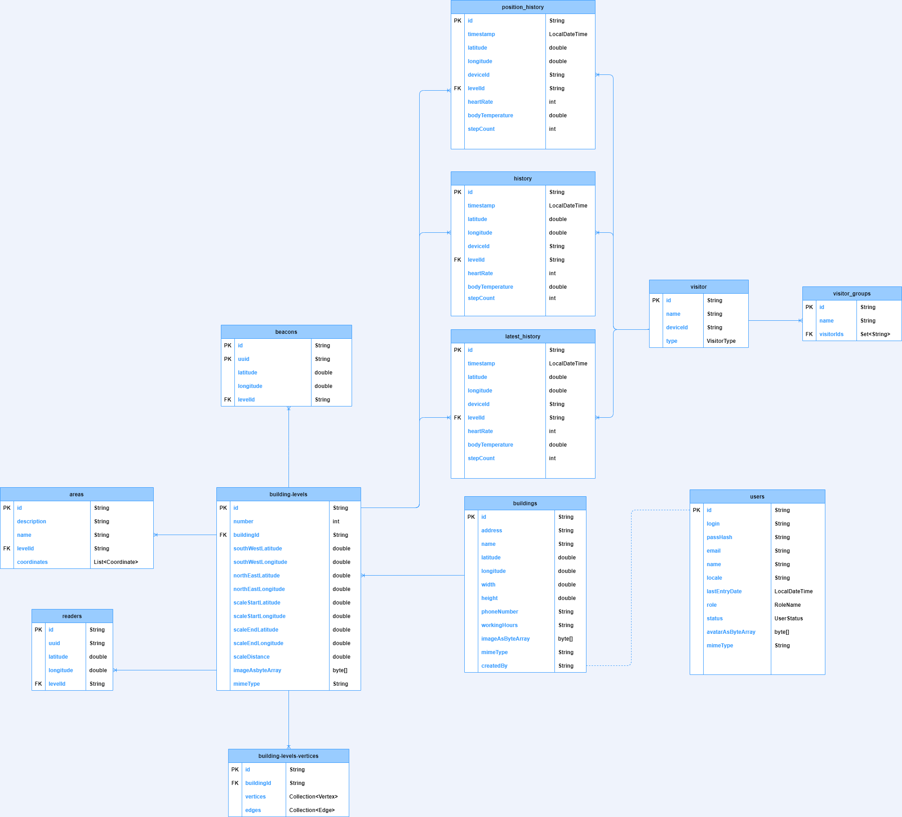

# Getting Started with Beacons Project

- Install Java JDK 8 or 11  
   For Windows: https://www.oracle.com/technetwork/java/javase/downloads/jdk8-downloads-2133151.html  
   Add bin files to environment variable PATH
   For UNIX: https://openjdk.java.net/install/  
   
- Install Gradle 6.5: https://gradle.org/releases/  
   Add bin file to environment variable PATH

- [Import SSL certificate in JDK to make Vault work (on Windows)](docs/vault.md)

- Install and initialize [MongoDB](docs/mongodb.md) and install
   [MongoDB Compass](https://www.mongodb.com/try/download/compass)

- Install git: https://git-scm.com/downloads

- Clone this repository

- [Download](docs/code_style_config_v3.1.xml) and [install](docs/img/importing_config.png) IDEA configuration  
  Set to true this setting in IDEA: `File > Settings... > Editor > General > Ensure an empty line at the end of a file
  on save`.  
  Add Gradle 6.5 to `Gradle user home` and in `Use Gradle from` choose `Specified location` and give path to Gradle 6.5
  folder.  
  Enable option `Generate *.iml files for modules imported from Gradle`. You should add point (.) before the folder's
  name ".gradle-6.5". If you wouldn't add this point, you could get error like `CreateProcess error=2,
  The system cannot find the file specified`.  
  If you are working on Windows machine, be sure, that path to your ".gradle-6.5" folder doesn't contain white spaces.

- Read and understand [Beacons Code Style Guide](docs/codestyle.md)

- Read and understand [Beacons Branching Guide](docs/branching.md)

- Read [documentation on microservices](docs/microservices.md)

# How to run the project for the first time
Make sure you follow these mandatory steps:

1. You are working from office network or using EPAM VPN

2. Your local machine complies with OPSWAT

3. Ask your team members or mentors to send you secrets.yaml file which contains required settings to make LOCAL profile
run without using Vault

4. Run microservices [in the right order](docs/microservices.md)  
    If you have some issues with starting microservices, you can check [common issues](https://kb.epam.com/display/EPMLSTR/%5BBackend%5D+FAQ),
    there could be your answer
    
5. [Run frontend](https://gitpct.epam.com/epm-lstr-bcn/bcnadm-front/-/tree/dev/beacon-admin-web#how-to-run-the-project)

# Swagger
You need to authorize before go to any link listed below.

For LOCAL environment:
- [UAA Service](http://localhost:10020/api/v1/uaa-service/swagger/swagger-ui.html)
- [Building Service](http://localhost:10020/api/v1/building-service/swagger/swagger-ui.html)
- [Monitor Service](http://localhost:10020/api/v1/monitor-service/swagger/swagger-ui.html)
- [Mobile Service](http://localhost:10020/api/v1/mobile-service/swagger/swagger-ui.html)

For TESTING environment:
- [UAA Service](http://tst.bcn.lab.epam.com/api/v1/uaa-service/swagger/swagger-ui.html)
- [Building Service](http://tst.bcn.lab.epam.com/api/v1/building-service/swagger/swagger-ui.html)
- [Monitor Service](http://tst.bcn.lab.epam.com/api/v1/monitor-service/swagger/swagger-ui.html)
- [Mobile Service](http://tst.bcn.lab.epam.com/api/v1/mobile-service/swagger/swagger-ui.html)

For DEV environment:
- [UAA Service](http://bcn-dev.lab.epam.com/api/v1/uaa-service/swagger/swagger-ui.html)
- [Building Service](http://bcn-dev.lab.epam.com/api/v1/building-service/swagger/swagger-ui.html)
- [Monitor Service](http://bcn-dev.lab.epam.com/api/v1/monitor-service/swagger/swagger-ui.html)
- [Mobile Service](http://bcn-dev.lab.epam.com/api/v1/mobile-service/swagger/swagger-ui.html)

For STAGING environment:
- [UAA Service](http://qa.bcn.lab.epam.com/api/v1/uaa-service/swagger/swagger-ui.html)
- [Building Service](http://qa.bcn.lab.epam.com/api/v1/building-service/swagger/swagger-ui.html)
- [Monitor Service](http://qa.bcn.lab.epam.com/api/v1/monitor-service/swagger/swagger-ui.html)
- [Mobile Service](http://qa.bcn.lab.epam.com/api/v1/mobile-service/swagger/swagger-ui.html)

For PRE-PROD environment:
- [UAA Service](http://bcn.lab.epam.com/api/v1/uaa-service/swagger/swagger-ui.html)
- [Building Service](http://bcn.lab.epam.com/api/v1/building-service/swagger/swagger-ui.html)
- [Monitor Service](http://bcn.lab.epam.com/api/v1/monitor-service/swagger/swagger-ui.html)
- [Mobile Service](http://bcn.lab.epam.com/api/v1/mobile-service/swagger/swagger-ui.html)

# MongoDB diagram

If you are having difficulty reading the diagram below, you can download .drawio file from [here](docs/mongo/mongodb_diagram.drawio)

# Tips for Mentors:

1. Don't forget to set **"Remove source branch"** flag. A lot of obsolete branches is a bad idea.

2. If you verify a merge request, please, push thumb up sign or hit **"Approve"** button
   and merge changes if there are no unresolved threads.

3. Set **"Squash commits"** flag only if absolutely required (see [Branching Guide](docs/branching.md)).
