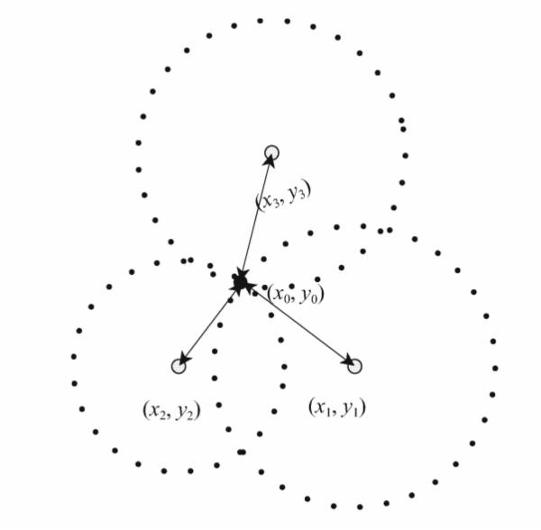
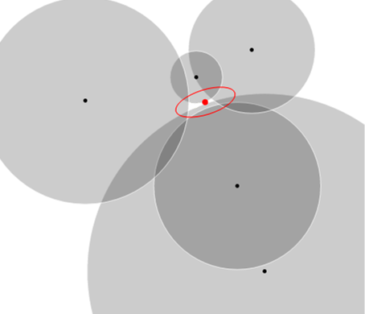
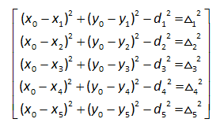
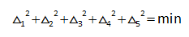

# overview
Trilateration algorithm is used to calculate position of the visitor (VisitorDto) based on data (RawReaderData) sent by readers using reader location
and a strength of the signal sent by visitor positioning device (wristband). For calculation of visitor position we use
5 measurements from any number (including 1) of readers that can receive the signal.
# crucial ideas
- If we know the position of the reader and a signal strength we can calculate the distance between visitor and reader.
- The signal strength is inversely proportional to the square of distance ([Inverse squares law](https://en.wikipedia.org/wiki/Inverse-square_law)).
- In telecommunication the inverse squares law for transmission of the signal is described by [Friis transmission equation](https://en.wikipedia.org/wiki/Friis_transmission_equation).
- While we know the signal strength (Received signal strength indication or RSSI) and reference power 
(also known as "Tx Power" or "1-meter RSSI") we can [calculate](https://iotandelectronics.wordpress.com/2016/10/07/how-to-calculate-distance-from-the-rssi-value-of-the-ble-beacon/) 
the distance between reader and visitor.
- Note also, that distance is calculated in 2 different ways depending the position inside electomagnetic field: [Near and far field](https://en.wikipedia.org/wiki/Near_and_far_field).
- When the distances between visitor and readers are calculated, his position can be found as a point of intersection 
of the circles, centered in readers` locations with radii equal to calculated distances:

here point (x0,y0) describes visitor position, points (x1,y1), (x2,y2) and (x3,y3) are readers locations

- However, in reality the signal strength (RSSI) we get is unstable and change randomly over time, that`s why 
we have to prepare the signal using [Kalman filter](https://kb.epam.com/pages/viewpage.action?pageId=571375275) and get a mean value.
- As a result, we cannot get a single point as the circles might not intersect. So we have to look for the
visitor position inside some elliptic area (covariance ellipse) between the circles:

- To find the visitor position we have to choose the optimal point (optimum). The problem of finding such point can be described
as a set of equations:

where x0 and y0 - visitor coordinates, x1-x5 and y1-y5 are readers 1-5 coordinates correspondingly, d1-d5 are calculated
by RSSI distances, delta 1-5 shows the difference between distance from the point (x0,y0) to the reader and the calculated
distance.

- That problem can be solved by the [least squares method](https://en.wikipedia.org/wiki/Least_squares) assuming that
the sum of square deviations should be minimal:

- In our project to solve that problem we use the Levenberg–Marquardt algorithm. As a result we get optimum and return it
as VisitorDto.

# useful links
 - [Solving of trilateration problem](https://github.com/lemmingapex/Trilateration)
 - [Discussion with author of Trilateration library about getting error ellipse from trilateration](https://github.com/lemmingapex/trilateration/issues/14)
 - [How to draw a covariance error ellipse](https://www.visiondummy.com/2014/04/draw-error-ellipse-representing-covariance-matrix/)
 - [A geometric interpretation of the covariance matrix](https://www.visiondummy.com/2014/04/geometric-interpretation-covariance-matrix/)
