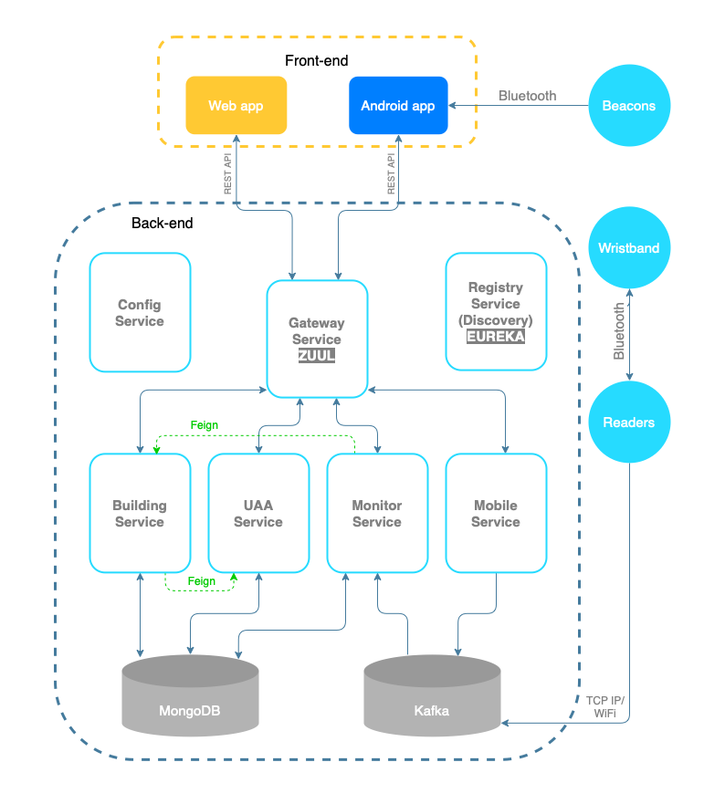
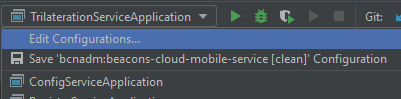
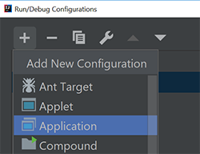
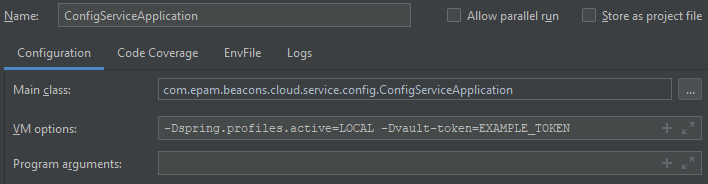
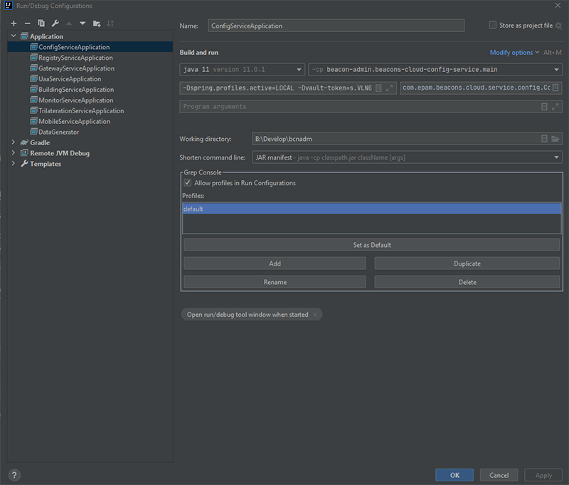

This is the short clipping of basic information about our microservices, their purpose, dependencies, how to run.

## What is microservice architecture?

>Long story short, microservice architecture style is the approach when one single application is built as set of few small services.
Each of these services work in its own process and communicate to another via lightweight mechanisms. Usually it is HTTP.
These services are based around business requirements and deploy independently by fully automated environment. There is an absolute minimum of centralized management of these services.
These services may be written in different languages and use different data storage technologies.

https://habr.com/post/249183/

The project undergone a transition from monolithic architecture to microservice one.

## Our services: names and purposes

| Name                              | Purpose                                                                                                                                                                                                                       | 
|-----------------------------------|-------------------------------------------------------------------------------------------------------------------------------------------------------------------------------------------------------------------------------|
|[beacons-cloud-config-service](../beacons-cloud-config-service/README.md)       |Gives configs to microservice by its demand.                                                                                                                                      |
|[beacons-cloud-registry-service](../beacons-cloud-registry-service/README.md)     |Registers microservices instances. Only this microservice knows about all another. Microservices talk via registry service.                                                     |
|[beacons-cloud-gateway](../beacons-cloud-gateway/README.md)              |Acts like a proxy. Redirects requests to other microservices.                                                                                                                            |
|[beacons-cloud-uaa-service](../beacons-cloud-uaa-service/README.md)          |Responsible for security part.                                                                                                                                                       |
|[beacons-cloud-building-service](../beacons-cloud-building-service/README.md)     |Building api: beacons, readers, buildings, edges, vertices, levels, areas.                                                                                                      |
|[beacons-cloud-monitor-service](../beacons-cloud-monitor-service/README.md)      |Convert raw coordinate data coming from readers to the DTOs, that include data about area, visitor and other. Then saves position data and provides access to position history.  |
|[beacons-cloud-mobile-service](../beacons-cloud-mobile-service/README.md)      |Receives data from mobile clients, processes it, and sends it to other microservices via Kafka.                                                                                    |

Note that services are listed in their launch order.

Microservices diagram image:  

## Running microservices

There are 4 main microservices that should be running in order to run other microservices: config-service, registry-service, gateway-service and uaa-service.

To run any microservice you should add run configuration:

1. Select "Edit Configurations..."  
   

2. Press "+" button and select "Application"   
   

3. Pick a Main class   
   

4. Add VM options
   `-Dspring.profiles.active=LOCAL -Dvault-token=s.VLNGt3ZYXnYWd99d62dVVBLt`

5. Select classpath module "main"

6. Set Shorten command line to "JAR manifest"   
   

To run microservice with another profile you should add additional VM options  
`-Dspring.profiles.active=DEV`

If you are running low on memory (for example your machine has only 8 GB of onboard RAM) you can try these VM options:

- `-XX:+UseSerialGC` This will perform garbage collection inline with the thread allocating the heap memory instead of a dedicated GC thread(s)

- `-Xss512k` This will limit each threads stack memory to 512 KB instead of the default 1 MB

- `-XX:MaxRAM=200m` This will restrict the JVM's calculations for the heap and non heap managed memory to be within the limits of this value (200 Megabytes for each microservice).

Monitor services is dependent on Kafka, you may find out how to launch it locally on [How to launch kafka and zookeper locally on Win10](https://kb.epam.com/display/EPMLSTR/How+to+launch+kafka+and+zookeper+locally+on+Win10).

More information could be found on [Onboarding. Quick Start](https://kb.epam.com/display/EPMLSTR/Onboarding.+Quick+Start)
