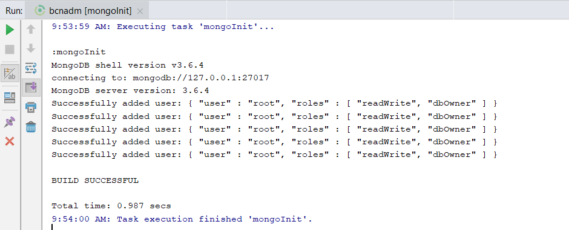

# MongoDB installation

This guide helps you install and initialize MongoDB.

1. Download and install MongoDB following instructions from the official site: https://docs.mongodb.com/manual/installation/
2. Add a Mongo bin directory path (e.g. `C:\Program Files\MongoDB\Server\3.6\bin`) to the system environment variable `PATH` if it's not there yet
3. Start mongod service
4. Download [mongo_init.js](../mongo_init.js) and initialize MongoDB by executing `mongo mongo_init.js` in the command line

# Result

If the task execution finished successfully MongoDB is ready to use.

